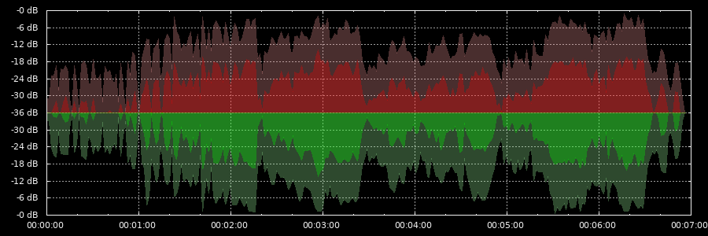

# plotRms



plot RMS values from audio file

```
DESCRIPTION:
plotRms will parse audio input and calculate RMS values for a given duration.
The results are plotted to an PNG image.
plotRms uses "rms" from the same package to detect peak and RMS values.

Usage: rms [OPTION...] audioFile

OPTIONS:
    -i --input  audio       path of any audio or video file to be plotted
    -o --output image       path of target PNG or SVG file, if ommited use audioFile.png
    -r --resolution VALUE   RMS window in seconds, default is 1.5
    -l --limit              cut off RMS values lower than limit in dB, default is -36
    -t --template FILE      use given gnuplot template file instead of build-in template
    -v --verbose            verbose output
    -h --help               this help
```

# rms

calculate audio file peak and RMS values
```
DESCRIPTION:

show RMS values and peak values for each window of an audio file.
Additionally show the number of channels, sample rate, exact duration and the 
overall RMS values of the left and the right channel.

Usage:rms -i <inputFile> [-o <outputFile>] [-r <resolution>]
 -i inputFile     audio file to be read, uses ffmpeg
 -o outputFile    write data to file
 -r VALUE         window in seconds
 -v               verbose
 -h               this help
```

```
Example: show audio peaks and RMS values with an 60 second window

$ rms -i audio.wav -r 60
inputFile='audio'
channels=2
sampleRate=48000

#seconds rmsL rmsR maxL maxR
0.00 -47.98 -48.93 -28.56 -29.77
60.00 -47.98 -48.93 -28.56 -29.77
120.00 -42.58 -42.64 -23.19 -19.69
180.01 -36.10 -34.96 -9.82 -3.03
240.01 -34.92 -35.17 -15.37 -15.61
300.01 -37.82 -38.78 -20.14 -17.13
360.01 -33.38 -33.51 -13.18 -8.35
416.53 -32.67 -33.33 -11.10 -8.85
#end of data

duration=416.53
duration=00:06:56.0525
rmsLeft=-35.93
rmsRight=-36.10
peakLeft=-32.67
peakRight=-33-33
```

# pulseRms

monitor currently playing audio on the command line.\
shows the current RMS and peak values for the first found playing pulseaudio device.

Example: 
```
$ pulseRms

#seconds rmsL rmsR peakL peakR
1 -39.27 -37.14 -25.77 -23.14
2 -36.83 -35.55 -25.37 -20.97
3 -34.82 -33.52 -21.53 -18.38
4 -30.49 -31.52 -19.36 -20.45
```